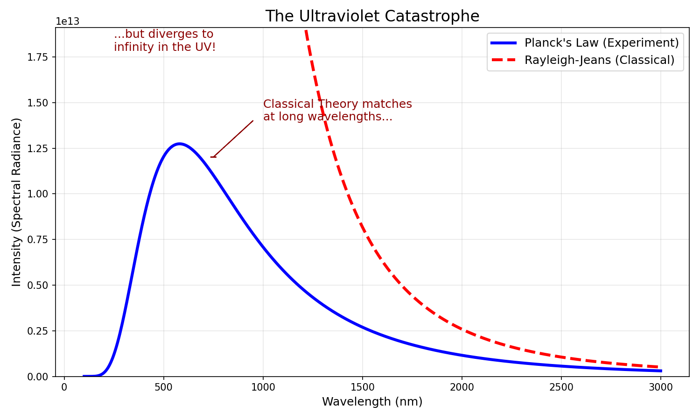

## The Breakdown of Classical Physics

Before the 20th century, physicists believed they had nearly solved the puzzle of the universe. Newton's laws described motion, thermodynamics described heat, and Maxwell's equations described light. However, when they tried to apply these rules to something as simple as a hot, glowing object, the math completely fell apart.

## Light and Electromagnetic Waves

Before we can understand where classical physics failed (the Ultraviolet Catastrophe), we need to establish a clear picture of what light actually *is*. While we will dive deeper into the nature of light later in the course, for now, we must understand its behavior as a wave.

### Light is an Electromagnetic Wave
James Clerk Maxwell discovered that light is not just a beam of particles, but a self-propagating wave composed of oscillating electric and magnetic fields.

* **The Electric Field ($E$):** Oscillates in one plane (e.g., up and down).
* **The Magnetic Field ($B$):** Oscillates in a perpendicular plane (e.g., left and right).
* **Direction of Travel:** The wave moves forward in a direction perpendicular to both fields.

### Wavelength ($\lambda$)
Because light acts as a wave, we can measure its physical size. If you were to freeze a light wave in time, the distance between two consecutive peaks (crests) is called the **wavelength**.

* **Symbol:** $\lambda$ (pronounced "lambda").
* **Units:** Meters ($m$), nanometers ($nm$), or Angstroms ($\text{\AA}$).
* **Visual:** Red light has a long wavelength ($\approx 700 \text{ nm}$), while violet light has a short wavelength ($\approx 400 \text{ nm}$).

### Frequency ($\nu$)
Imagine standing at a fixed point in space as a light wave rushes past you. If you counted how many wave crests passed your eyes in exactly one second, you would have measured the **frequency**.

* **Symbol:** $\nu$ (pronounced "nu"). *Note: Be careful not to confuse this with the letter 'v' for velocity.*
* **Units:** Hertz ($Hz$) or "per second" ($s^{-1}$).
* **Concept:** A wave with a short wavelength is "scrunched up," so more crests will pass you in a second (High Frequency). A wave with a long wavelength is spread out, so fewer crests will pass you (Low Frequency).

### The Universal Speed Limit ($c$)
One of the most profound discoveries in physics is that in a vacuum, all light—regardless of whether it is radio waves, visible light, or gamma rays—travels at exactly the same speed.

* **Symbol:** $c$ (celeritas).
* **Value:** Approximately $3.00 \times 10^8 \text{ m/s}$ (or $300,000 \text{ km/s}$).

### The Relationship: $\lambda\nu = c$
Because the speed of light is constant, wavelength and frequency are **inversely proportional**.
* If the wavelength ($\lambda$) gets **longer**, the frequency ($\nu$) must get **lower** to keep the speed the same.
* If the wavelength gets **shorter**, the frequency must get **higher**.

Mathematically, this relationship is defined in Equation {eq}`wave_freq`:

:::{math}
:label: wave_freq
\lambda\nu = c
:::

Where:
* $\lambda$ is the wavelength in meters ($m$).
* $\nu$ is the frequency in Hertz ($s^{-1}$).
* $c$ is the speed of light ($m/s$).

### The Ultraviolet Catastrophe

In the late 19th century, physicists were trying to model **blackbody radiation**—the light emitted by an object simply because it is hot, like a glowing iron bar or the filament of a light bulb. Classical physics approached this by assuming that the oscillating atoms in the object could vibrate at any frequency and emit energy continuously. 

This classical model is known as the **Rayleigh-Jeans Law**. It predicts the intensity of light ($I$) emitted at a specific wavelength ($\lambda$) based on the temperature ($T$) and Boltzmann's constant ($k_B$):

:::{math}
:label: rayleigh_jeans
I(\lambda) = \frac{2ck_BT}{\lambda^4}
:::

This equation was actually quite successful at describing **long wavelengths** (infrared and red light). In this region, the experimental data matched the classical prediction almost perfectly.

However, the model broke down spectacularly when applied to **short wavelengths** (ultraviolet light). Look at the denominator in Equation {eq}`rayleigh_jeans`: $\lambda^4$. As the wavelength gets smaller ($\lambda \to 0$), dividing by a tiny number makes the result huge. The math predicted that as you moved into the UV range, the intensity of the light should shoot up to infinity. 

*Figure 1: The solid blue line shows the actual light emitted by a hot object (Planck's Law). The dashed red line shows the classical prediction (Rayleigh-Jeans). Note how the red line follows the blue line on the right (long $\lambda$) but shoots up to infinity on the left (short $\lambda$) as the $1/\lambda^4$ term takes over.*

This prediction—that a toaster should emit infinite energy and instantly vaporize everything around it—was clearly wrong. Nature puts a limit on high-energy emissions, causing the curve to peak and then drop to zero. This disagreement between theory and reality became known as the **Ultraviolet Catastrophe**.
:::{code-cell} python
:tags: ["remove-input"]
# --- START: Required for every block that imports from _ext ---
import sys
import os
from IPython.display import display, HTML

# Adjust the path based on file depth
try:
    cwd = os.getcwd()
    # e.g., use ("..", "..") for a file 2 levels deep.
    project_root = os.path.abspath(os.path.join(cwd, "..", "..", ".."))
    if project_root not in sys.path:
        sys.path.insert(0, project_root)
except Exception as e:
    print(f"Error setting project path: {e}")

from _ext.interactive_qa import QuestionBlock
# --- END: Required for every block ---
questions = QuestionBlock()
questions.add_question(
    question_id="sec-02-ch-1-q01",
    question_text="In the context of the Ultraviolet Catastrophe, why was the classical prediction of infinite energy at short wavelengths physically impossible?"
)
display(HTML(questions.render()))
:::

### Planck's Constant

In 1900, Max Planck resolved this catastrophe by introducing a radical assumption. Classical physics assumed that energy was continuous—that an oscillator could have *any* amount of energy. Planck proposed instead that energy is **quantized**. He suggested that energy could only be emitted or absorbed in discrete "packets" (quanta), where the energy of a packet is proportional to its frequency.

This leads to **Planck's Law**, which modifies the classical formula:

:::{math}
:label: plancks_law
I(\lambda) = \frac{2hc^2}{\lambda^5} \frac{1}{e^{\frac{hc}{\lambda k_B T}} - 1}
:::

Here, $h$ is a fundamental number now known as **Planck's Constant** ($h \approx 6.626 \times 10^{-34} \text{ J}\cdot\text{s}$).

**Why this fixes the curve:**
Notice the new exponential term in the denominator: $e^{\frac{hc}{\lambda k_B T}}$. 
* At **long wavelengths** (large $\lambda$), this term is small, and the equation simplifies back to the Rayleigh-Jeans law. This explains why the red and blue lines match on the right side of Figure 1.
* At **short wavelengths** (small $\lambda$), the $1/\lambda$ inside the exponent makes the $e^{\dots}$ term explode to a massive number. Since this massive number is in the *denominator*, it crushes the total intensity down to zero. This creates the "peak and drop" shape seen in the blue line, matching reality perfectly.

**The "Vending Machine" Analogy:**
To understand the concept without the calculus, imagine paying a bill.
* **Classical View:** You can pay any amount using any combination of coins. If an item costs $\$1,000$, you can pay for it using 100,000 pennies. Since you can always scrape together enough small change (thermal energy), you can excite any vibration easily, leading to the runaway infinity.
* **Planck's View:** Nature is like a vending machine that **does not accept change**. It only accepts specific bills for specific items.
    * For **low frequencies** (long $\lambda$), the "bill" is small (like a penny). The thermal energy of the atoms can easily provide these small packets.
    * For **high frequencies** (UV light), the energy gap $h\nu$ becomes very large—like a $\$1,000$ bill. 

In the quantum world, it does not matter if you have $\$1,000$ worth of pennies; the machine will not accept them. You must have a single $\$1,000$ bill to trigger that high-frequency mode. Because the random thermal motion of the atoms rarely produces a single "chunk" of energy that large, the high-frequency modes remain "frozen out." They simply cannot be activated, preventing the energy from blowing up to infinity.

:::{code-cell} python
:tags: ["remove-input"]
# --- START: Required for every block that imports from _ext ---
import sys
import os
from IPython.display import display, HTML

# Adjust the path based on file depth
try:
    cwd = os.getcwd()
    # e.g., use ("..", "..") for a file 2 levels deep.
    project_root = os.path.abspath(os.path.join(cwd, "..", "..", ".."))
    if project_root not in sys.path:
        sys.path.insert(0, project_root)
except Exception as e:
    print(f"Error setting project path: {e}")

from _ext.interactive_qa import QuestionBlock
# --- END: Required for every block ---
questions = QuestionBlock()
questions.add_question(
    question_id="sec-02-ch-1-q02",
    question_text="In the Ultraviolet Catastrophe, why does the requirement that energy be purchased in discrete chunks ($h\nu$) prevent high-frequency light from reaching infinite intensities?"
)
display(HTML(questions.render()))
:::
## The Photoelectric Effect

While Planck was solving the Ultraviolet Catastrophe by quantizing energy in hot objects, Albert Einstein was looking at a different puzzle involving light and metal.

The **Photoelectric Effect** is a phenomenon where light is shone onto a metal surface. Under specific conditions, electrons are ejected from the surface of the metal. Because these ejected electrons have mass and are moving, they possess kinetic energy.

Recall the definition of Kinetic Energy from Equation {ref}`kinetic_energy`:

:::{math}
:label: kinetic_energy
KE = \frac{1}{2}mv^2
:::
:::{code-cell} python
:tags: ["remove-input"]
# --- START: Required for every block that imports from _ext ---
import sys
import os
from IPython.display import display, HTML

# Adjust the path based on file depth
try:
    cwd = os.getcwd()
    # e.g., use ("..", "..") for a file 2 levels deep.
    project_root = os.path.abspath(os.path.join(cwd, "..", "..", ".."))
    if project_root not in sys.path:
        sys.path.insert(0, project_root)
except Exception as e:
    print(f"Error setting project path: {e}")

from _ext.interactive_qa import QuestionBlock
# --- END: Required for every block ---
questions = QuestionBlock()
questions.add_question(
    question_id="sec-02-ch-1-q03",
    question_text="In the photoelectric effect, why was it so shocking to classical physicists that the intensity of light had no effect on the maximum kinetic energy of the ejected electrons?"
)
display(HTML(questions.render()))
:::
### The One-to-One Interaction
Classical physics predicted that if you simply made the light **brighter** (increased the intensity), the electrons would absorb more energy and be ejected faster. However, experiments showed this was wrong. If you shine a bright red light on a metal, **nothing happens**. But if you shine a dim blue light, electrons pop off immediately.

Einstein realized this meant light was not a continuous wave of energy washing over the metal, but a stream of discrete particles (later called **photons**). Crucially, the interaction between light and matter is **one-to-one**. One photon hits one electron.

**The Bowling Pin Analogy:**
Imagine an electron stuck in the metal is a heavy bowling pin. To knock it over (eject it), you need to hit it with a single ball.
* **Low Frequency Light (Red):** This is like throwing a **ping-pong ball**. It doesn't matter if you throw one ping-pong ball or a thousand of them at the same time (high intensity); they simply bounce off. The individual "packet" of energy is too light to do the job.
* **High Frequency Light (Blue/UV):** This is like throwing a **cannonball**. Even if you only throw one (low intensity), it packs enough punch in that *single* impact to knock the pin flying.
:::{code-cell} python
:tags: ["remove-input"]
# --- START: Required for every block that imports from _ext ---
import sys
import os
from IPython.display import display, HTML

# Adjust the path based on file depth
try:
    cwd = os.getcwd()
    # e.g., use ("..", "..") for a file 2 levels deep.
    project_root = os.path.abspath(os.path.join(cwd, "..", "..", ".."))
    if project_root not in sys.path:
        sys.path.insert(0, project_root)
except Exception as e:
    print(f"Error setting project path: {e}")

from _ext.interactive_qa import QuestionBlock
# --- END: Required for every block ---
questions = QuestionBlock()
questions.add_question(
    question_id="sec-02-ch-1-q04",
    question_text="Explain the one-to-one interaction concept in Einstein's explanation of the photoelectric effect."
)
display(HTML(questions.render()))
:::

### The Energy Equation
Because the interaction is one-to-one, the energy of that single photon determines everything. Einstein used Planck's constant to define the energy of a single photon:

:::{math}
:label: photon_energy
E_{photon} = h\nu = \frac{hc}{\lambda}
:::

### The Work Function and Threshold
The electron is held to the metal surface by an attractive force. To leave, it must pay an "energy tax" called the **Work Function** ($\Phi$).
* If the incoming photon has less energy than the work function ($h\nu < \Phi$), the electron stays stuck (the ping-pong ball scenario).
* If the photon has more energy ($h\nu > \Phi$), the electron pays the tax and keeps the rest as **Kinetic Energy**.

This gives us the conservation of energy equation for the Photoelectric Effect:

:::{math}
:label: photoelectric_eq
KE_{electron} = h\nu - \Phi
:::

### Interactive Graph: Kinetic Energy vs. Frequency
The graph below visualizes Equation {eq}`photoelectric_eq`. Notice:
1.  **Threshold Frequency:** The graph doesn't start at zero. It touches the x-axis at a specific frequency where $h\nu = \Phi$. Below this frequency, no electrons are ejected ($KE=0$).
2.  **Linear Slope:** Once past the threshold, the Kinetic Energy increases linearly with frequency. The slope of this line is exactly Planck's constant ($h$).

:::{include} interactive_code/photo_electric_effect.md
:::
